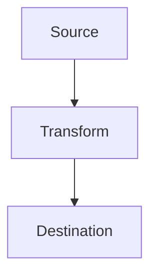

# SSIS Migration Tool - Product Requirements Document

**Version:** 2.0  
**Date:** June 24, 2025  
**Document Type:** Product Requirements Document (PRD)

## Executive Summary

The SSIS Migration Tool is a focused solution designed to parse, analyze, and migrate SQL Server Integration Services (SSIS) packages to modern ETL platforms. The tool provides a command-line interface to convert .dtsx files into Python-based ETL scripts with validation, testing, and rollback capabilities.

## Problem Statement

Organizations using SSIS face challenges when migrating to modern ETL platforms due to:
- Complex package structures with interdependencies
- External configurations scattered across multiple files
- Business logic embedded in various SSIS components
- Lack of automated translation capabilities
- Time-intensive manual migration processes
- Risk of data loss during migration
- Difficulty validating converted code functionality

## Solution Overview

A command-line tool that automatically parses SSIS packages and generates:
- Standalone Python ETL scripts with equivalent functionality
- Comprehensive validation and testing framework
- Migration rollback capabilities
- Performance benchmarking tools
- Incremental migration support

---

# MVP Command-Line Tool Requirements

## 1. Core Functionality

### 1.1 SSIS Package Processing (MVP Focus)
- **Input Support:**
  - .dtsx files (XML-based SSIS packages)
  - .dtsConfig configuration files
  - External connection managers
  - Parameter files
  - Environment variables

- **Component Coverage (MVP):**
  - **Phase 1:** SSIS Data Flow components (priority)
    - Source and destination components
    - Derived Column transformations
    - Data conversion transformations
    - Lookup transformations
    - Connection managers
    - Variables and parameters
  - **Phase 2:** Control Flow tasks
    - Execute SQL Tasks
    - Script Tasks (basic conversion)
    - Sequence Containers
    - Precedence constraints

### 1.2 Output Generation
- **Python Scripts:**
  - Single standalone executable script per package
  - Environment variable-based configuration
  - Standard library usage (pandas, sqlalchemy, pyodbc)
  - Error handling and logging
  - Performance monitoring hooks

- **Documentation:**
  - Markdown files with complete metadata
  - Mermaid diagrams for data lineage
  - Variable mapping tables
  - Migration validation results
  - Performance comparison data

### 1.3 Simplified File Structure
```
output/
├── package1.py
├── package1.md
├── package1_tests.py
├── package1_validation.json
├── package1_performance.json
└── migration_summary.md
```

## 2. Migration Validation & Testing

### 2.1 Code Validation
- **Syntax Validation:** Ensure generated Python code is syntactically correct
- **Dependency Check:** Validate all required libraries are available
- **Configuration Validation:** Verify connection strings and parameters
- **Data Type Mapping:** Validate SSIS to Python data type conversions

### 2.2 Testing Framework
- **Unit Test Generation:** Create pytest-based tests for each component
- **Sample Data Testing:** Test with sample datasets when available
- **Integration Tests:** Validate end-to-end data flow
- **Performance Tests:** Benchmark data processing speed

### 2.3 Validation Reports
```json
{
  "package_name": "package1",
  "validation_status": "success",
  "tests_passed": 15,
  "tests_failed": 0,
  "performance_improvement": "+25%",
  "manual_review_required": false,
  "issues": []
}
```

## 3. Rollback Strategy

### 3.1 Backup Management
- **Original Package Backup:** Automatically backup original .dtsx files
- **Version Control:** Track all migration attempts with timestamps
- **Configuration Backup:** Preserve original connection strings and parameters

### 3.2 Rollback Capabilities
- **One-Click Rollback:** Restore original SSIS package and configuration
- **Selective Rollback:** Rollback specific packages while keeping others
- **Validation Before Rollback:** Ensure rollback won't cause data loss
- **Rollback Logging:** Track all rollback operations for audit purposes

### 3.3 Rollback Commands
```bash
ssis-migrator rollback --package package1.dtsx
ssis-migrator rollback --all
ssis-migrator rollback --validate-only
```

## 4. Incremental Migration

### 4.1 Package-by-Package Processing
- **Individual Package Conversion:** Convert one package at a time
- **Dependency Resolution:** Handle package interdependencies
- **Validation Per Package:** Validate each package before proceeding
- **Rollback Per Package:** Allow rollback of individual packages

### 4.2 Migration Planning
- **Dependency Analysis:** Identify package execution order
- **Risk Assessment:** Flag high-risk packages for manual review
- **Migration Roadmap:** Generate step-by-step migration plan
- **Progress Tracking:** Track migration status across all packages

### 4.3 Incremental Commands
```bash
ssis-migrator convert --package package1.dtsx --validate
ssis-migrator convert --package package1.dtsx --test
ssis-migrator convert --package package1.dtsx --benchmark
ssis-migrator plan --input-dir ./ssis-packages
```

## 5. Performance Comparison

### 5.1 Benchmarking Framework
- **Execution Time Comparison:** Measure SSIS vs. Python execution time
- **Memory Usage Analysis:** Compare memory consumption
- **Throughput Measurement:** Data processing rate comparison
- **Resource Utilization:** CPU and I/O usage analysis

### 5.2 Performance Metrics
```json
{
  "original_ssis": {
    "execution_time": "120s",
    "memory_usage": "512MB",
    "throughput": "1000 rows/sec"
  },
  "converted_python": {
    "execution_time": "90s",
    "memory_usage": "256MB",
    "throughput": "1200 rows/sec"
  },
  "improvement": {
    "time_reduction": "25%",
    "memory_reduction": "50%",
    "throughput_increase": "20%"
  }
}
```

### 5.3 Performance Optimization
- **Code Optimization Suggestions:** Recommend performance improvements
- **Resource Tuning:** Suggest optimal memory and CPU settings
- **Parallel Processing:** Identify opportunities for parallel execution
- **Caching Strategies:** Recommend data caching approaches

## 6. Command-Line Interface

### 6.1 Basic Usage
```bash
ssis-migrator [COMMAND] [OPTIONS] INPUT_PATH OUTPUT_PATH
```

### 6.2 Commands
- `convert`: Convert SSIS package to Python
- `validate`: Validate converted code
- `test`: Run tests on converted code
- `benchmark`: Compare performance
- `rollback`: Rollback migration
- `plan`: Generate migration plan

### 6.3 Options
- `--package`: Specific package to process
- `--validate`: Enable validation
- `--test`: Enable testing
- `--benchmark`: Enable performance benchmarking
- `--backup`: Create backup before migration
- `--verbose`: Enable detailed logging
- `--dry-run`: Validate inputs without generating output

### 6.4 Example Usage
```bash
# Convert single package with validation and testing
ssis-migrator convert --package package1.dtsx --validate --test --benchmark

# Generate migration plan for all packages
ssis-migrator plan --input-dir ./ssis-packages --output-dir ./migration-plan

# Rollback specific package
ssis-migrator rollback --package package1.dtsx
```

## 7. Technical Requirements

### 7.1 Performance
- Process single .dtsx file in under 5 minutes
- Memory-efficient XML parsing
- Progress indicators for processing
- Parallel processing for validation and testing

### 7.2 Error Handling
- Continue processing on non-critical errors
- Generate comprehensive error summary reports
- Validate .dtsx file integrity
- Handle missing .dtsConfig files gracefully
- Provide clear error messages with resolution steps

### 7.3 Configuration Resolution
- Parse and merge .dtsConfig files during processing
- Resolve external connection managers
- Document configuration dependencies
- Handle encrypted configurations with user prompts

## 8. Distribution Requirements
- Single executable file (.exe for Windows, binary for Linux/Mac)
- Minimal external dependencies
- Cross-platform compatibility
- Self-contained Python runtime for testing

---

# Phase 2: Web Application

## 1. Core Functionality

### 1.1 File Upload & Management
- Drag-and-drop interface for .dtsx files
- Bulk upload for multiple packages
- File validation and preview
- Configuration file association
- Project organization and management

### 1.2 Interactive Parsing & Preview
- Real-time package structure visualization
- Component-level inspection
- Configuration dependency mapping
- Data flow diagram generation
- Error highlighting and resolution

### 1.3 Code Generation & Download
- On-demand Python script generation
- Customizable output templates
- Batch processing management
- Download individual or packaged results
- Version control integration hooks

## 2. User Interface Requirements

### 2.1 Dashboard
- Project overview with migration status
- Recent activity and processing history
- Quick access to common functions
- System health and performance metrics

### 2.2 Package Explorer
- Tree view of uploaded packages
- Component hierarchy visualization
- Search and filter capabilities
- Dependency relationship mapping

### 2.3 Code Editor & Preview
- Syntax-highlighted Python code preview
- Side-by-side SSIS vs. Python comparison
- Inline documentation viewing
- Custom template editing

### 2.4 Documentation Viewer
- Rendered markdown documentation
- Interactive Mermaid diagrams
- Exportable reports
- Print-friendly formatting

## 3. Technical Architecture

### 3.1 Frontend
- **Framework:** Modern web framework (React/Vue.js)
- **UI Components:** Responsive design with drag-drop
- **Visualization:** Mermaid.js for diagrams
- **Code Editor:** Monaco Editor or CodeMirror

### 3.2 Backend
- **API:** RESTful API with file upload handling
- **Processing:** Asynchronous job queue system
- **Storage:** File system or cloud storage integration
- **Authentication:** Basic user management

### 3.3 Database
- **User Management:** Basic authentication
- **Project Metadata:** Package information and processing status
- **Configuration Storage:** Connection strings and parameters
- **Audit Logging:** User actions and system events

---

# Shared Technical Specifications

## 1. SSIS Component Support Matrix

| Component Type | Phase 1 (MVP) | Phase 2 | Documentation |
|----------------|----------------|---------|---------------|
| Data Flow Sources | ✅ Full | ✅ Full | ✅ Complete |
| Data Flow Destinations | ✅ Full | ✅ Full | ✅ Complete |
| Data Flow Transformations | ✅ Full | ✅ Full | ✅ Complete |
| Execute SQL Tasks | ❌ | ✅ Full | ✅ Complete |
| Script Tasks (C#) | ❌ | ⚠️ Basic | ✅ Complete |
| Script Tasks (VB.NET) | ❌ | ⚠️ Basic | ✅ Complete |
| Connection Managers | ✅ Full | ✅ Full | ✅ Complete |
| Variables/Parameters | ✅ Full | ✅ Full | ✅ Complete |
| Event Handlers | ❌ | ⚠️ Partial | ✅ Complete |
| Foreach Loops | ❌ | ✅ Full | ✅ Complete |
| Sequence Containers | ❌ | ✅ Full | ✅ Complete |

## 2. Python Code Generation Standards

### 2.1 Code Structure
```python
#!/usr/bin/env python3
"""
Generated ETL Script: {package_name}
Original SSIS Package: {dtsx_path}
Generated Date: {timestamp}
Migration Version: {version}
"""

import os
import logging
import pandas as pd
import sqlalchemy as sa
from datetime import datetime
import time

# Performance monitoring
start_time = time.time()

# Environment Variables Configuration
DB_CONNECTION = os.getenv('DB_CONNECTION_STRING')
FILE_PATH = os.getenv('ETL_FILE_PATH')

# Logging setup
logging.basicConfig(level=logging.INFO)
logger = logging.getLogger(__name__)

def main():
    """Main ETL function generated from SSIS package."""
    try:
        logger.info(f"Starting ETL process for {package_name}")
        
        # Generated ETL logic here
        
        execution_time = time.time() - start_time
        logger.info(f"ETL process completed in {execution_time:.2f} seconds")
        
    except Exception as e:
        logger.error(f"ETL process failed: {str(e)}")
        raise

if __name__ == "__main__":
    main()
```

### 2.2 Library Dependencies
- **pandas**: Data manipulation and analysis
- **sqlalchemy**: Database connections and ORM
- **pyodbc**: ODBC database connectivity
- **logging**: Comprehensive logging framework
- **configparser**: Configuration file handling
- **pathlib**: File system path operations
- **pytest**: Testing framework (for generated tests)

## 3. Testing Framework Template

### 3.1 Generated Test Structure
```python
import pytest
import pandas as pd
from unittest.mock import Mock, patch

class TestPackage1:
    """Generated tests for package1 ETL script."""
    
    def test_data_flow_validation(self):
        """Test data flow components."""
        # Generated test logic
        
    def test_connection_validation(self):
        """Test database connections."""
        # Generated test logic
        
    def test_transformation_validation(self):
        """Test data transformations."""
        # Generated test logic
        
    def test_performance_benchmark(self):
        """Test performance against original SSIS."""
        # Generated benchmark logic
```

## 4. Documentation Template

### 4.1 Markdown Structure
```markdown
# Package Name: {package_name}

## Overview
- **Source File:** {dtsx_path}
- **Generated Date:** {timestamp}
- **Migration Status:** {status}
- **Validation Status:** {validation_status}
- **Performance Improvement:** {performance_improvement}

## Data Flow Diagram


## Components
### Data Flow Components
### Variables and Parameters
### Connection Managers

## Migration Notes
### Conversion Details
### Manual Review Required
### Performance Considerations
### Testing Results
### Rollback Instructions
```

## 5. Error Handling & Reporting

### 5.1 Error Categories
- **Critical:** Cannot process package (malformed XML)
- **Warning:** Partial conversion (unsupported components)
- **Info:** Successfully processed with notes
- **Validation:** Test failures or performance issues

### 5.2 Summary Report Format
```markdown
# Migration Summary Report

## Processing Statistics
- **Total Packages:** 10
- **Successful:** 8
- **With Warnings:** 2
- **Failed:** 0

## Validation Results
- **Tests Passed:** 45
- **Tests Failed:** 0
- **Performance Improved:** 8 packages
- **Performance Degraded:** 0 packages

## Component Conversion Success Rate
- **Data Flow Components:** 100%
- **Connection Managers:** 100%
- **Variables/Parameters:** 100%

## Manual Review Required
- Complex transformation logic
- Custom component implementations
- Encrypted connection strings
```

---

# Success Criteria

## MVP Command-Line Tool
- ✅ Process single .dtsx file in under 5 minutes
- ✅ Generate syntactically correct Python scripts
- ✅ Comprehensive validation and testing
- ✅ 95%+ data flow component parsing accuracy
- ✅ Detailed error reporting and rollback capabilities
- ✅ Performance benchmarking and comparison
- ✅ Incremental migration support

## Phase 2 Web Application
- ✅ Intuitive drag-and-drop interface
- ✅ Real-time processing feedback
- ✅ Interactive documentation viewing
- ✅ Basic user management
- ✅ Secure file handling and storage

## Shared Goals
- ✅ Maintain original SSIS functionality
- ✅ Reduce manual migration effort by 80%
- ✅ Generate production-ready Python code
- ✅ Complete audit trail and documentation
- ✅ Cross-platform compatibility
- ✅ Zero data loss during migration

---

# Future Enhancements

## Phase 3 Features
- Integration with popular ETL orchestration platforms (Airflow, Prefect)
- Advanced C# to Python AI-assisted conversion
- Performance optimization recommendations
- Cloud deployment templates (AWS, Azure, GCP)
- Multi-language ETL generation (Scala, Java)

## Phase 4 Features
- Real-time SSIS monitoring and migration planning
- Machine learning-based conversion optimization
- Integration with version control systems
- Automated deployment pipelines
- Advanced collaboration features